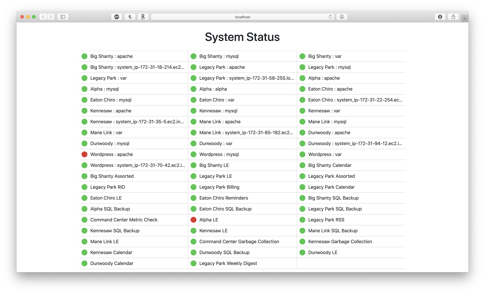

# Command Center
##### Continuous monitoring tool for cron jobs and system vitals (using Monit)

## Usage
You can either host your own instillation of this program or use my hosted version at [https://dev.rybel-llc.com/commandcenter](https://dev.rybel-llc.com/commandcenter)

## Tracking Cron Jobs/Systems
__Cron Jobs__: All you have to do is add a bit of additional code to the `crontab`. After a cron job runs, just add a `curl` call to our API to confirm that the job ran successfully. Our documentation will give you the exact details on what to do.

__System Monitoring__: First you have to configure [Monit](https://mmonit.com/monit/) to track your system metrics and expose a web interface. Once you've done this, just add you Monit login credentials to this system and Command Center will periodically poll your Monit instances and report back on all the system statuses.

## Display Page
This program also has a display page that can be used as a dashboard that quickly shows all the jobs/systems you are tracking.
  - Green is operating normally
  - Yellow is degraded (mouse over it for more details)
  - Red is a problem (mouse over it for more details)
The display page also supports a URL parameter to display all jobs/systems or only those with problems.
Use `errorOnly` = `true` to only display problems or `false` (the default value) to display all jobs/systems.

## Custom Installation
1. Create a new database and import the contents of `CommandCenter.sql`
2. Update the credentials in `config example.ini`
3. Rename `config example.ini` to `config.ini`
4. Create a new Google API Credential ([done here](https://console.developers.google.com/apis/credentials)) and place the `client_secret.json` in the root directory of the project
5. Place the code on a server capable of running PHP
6. Create the cron jobs located in `cronjobs.txt`

## Other Tips
In addition to this, I also have setup a script to send me an email every morning with the contents of the display page for quick access to see what jobs are running correctly and which aren't.
